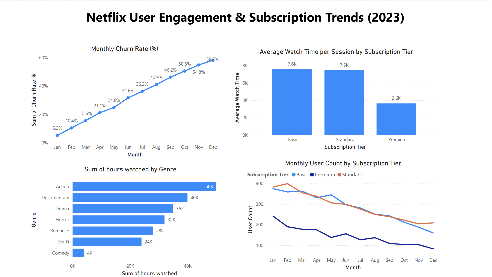

# 📈 Netflix User Engagement & Subscription Trend Analysis (2023)

---

## 📚 Table of Contents
- [Project Background](#project-background)
- [Data Cleaning & Preparation](#data-cleaning--preparation)
- [Executive Summary](#executive-summary)
- [Insights Deep Dive](#insights-deep-dive)
  - [Subscription and Churn Trends](#subscription-and-churn-trends)
  - [User Engagement Trends](#user-engagement-trends)
  - [Content Genre Popularity](#content-genre-popularity)
  - [User Count by Subscription Tier](#user-count-by-subscription-tier)
- [Recommendations](#recommendations)
- [Assumptions and Caveats](#assumptions-and-caveats)
- [Files and Resources](#files-and-resources)

---

## 📚 Project Background
Netflix, a global leader in streaming services, serves millions of subscribers worldwide.  
This project analyzes 2023 subscription patterns, user engagement behaviors, and content preferences to deliver actionable insights aimed at reducing churn, boosting engagement, and guiding content strategy decisions.

---

## 🧹 Data Cleaning & Preparation

The dataset was cleaned and prepared in two main phases using **Excel** and **Python**:

### 🔹 Excel (Initial Cleaning)
- **Date Formatting:**  
  - Combined Year and Month into a proper `Date` column (`YYYY-MM` format).
  - Extracted `Year` and `Month` as separate columns for easier time-series analysis.
- **Added New Calculations:**  
  - Created `Average Watch Time per Session` by dividing `HoursWatched` by `SessionsCount` using Excel formulas.
- **Standardization:**  
  - Ensured consistent formatting for categorical variables (`SubscriptionTier`, `Churned`, `ContentGenreFavorite`).
  - Retained `Unknown` values to realistically reflect missing information.
- **Initial Clean-Up:**  
  - Fixed data types (e.g., text fields, numeric fields).
  - Checked for and removed duplicate rows based on `UserID` and `Date`.

### 🔹 Python (Advanced Cleaning & Feature Engineering)
- **Data Import:** Loaded the cleaned Excel file into Python using `pandas`.
- **Data Type Validation:** Ensured correct types (e.g., dates as `datetime`, numerical columns as `float` or `int`).
- **Feature Engineering:**  
  - Calculated **Monthly Churn Rate**: Number of churned users / Total users per month.
  - Aggregated **Total Watch Hours** by `Genre` and `Month`.
  - Summarized **Average Watch Time** across subscription tiers.
- **Null Handling:**  
  - Verified that essential columns (`HoursWatched`, `Churned`) had no missing or invalid values.
- **Export for Visualization:** Finalized dataset was exported for use in Power BI dashboards.

---

## 🧩 Executive Summary
Analysis of Netflix’s user engagement and subscription trends in 2023 reveals an alarming rise in churn rates, particularly in Q4, with December reaching 58.2%. Action and Documentary genres emerged as the most engaging, while Basic and Standard tiers outperformed Premium in user retention and watch time.

User activity declines toward the year-end, suggesting seasonal disengagement. Strategic efforts focused on high-performing genres, re-engaging Premium tier users, and enhancing loyalty programs can drive sustainable retention and growth.

---

## 📊 Insights Deep Dive

### 🚀 Subscription and Churn Trends
- Churn increased steadily from **5.2%** (January) to **58.2%** (December).
- Subscriber losses were most significant during Q4, indicating a seasonal pattern.

📈 **Dashboard Snapshot:**

---

### ⏳ User Engagement Trends
- **Average Watch Time** per session:
  - Basic: **7.6K hours**
  - Standard: **7.5K hours**
  - Premium: **3.6K hours** (significantly lower)

---

### 🎬 Content Genre Popularity
- **Top Genres by Total Hours Watched:**
  - Action: **50K hours**
  - Documentary: **40K hours**
  - Drama: **35K hours**

---

### 👥 User Count by Subscription Tier
- Basic and Standard tiers maintained higher retention across the year.
- Premium subscriptions saw the steepest declines, especially mid-year.

---

## 📝 Recommendations
1. **Retention Strategy for Q4:**
   - Launch proactive churn prevention campaigns starting in Q3.
   - Offer exclusive releases or promotions during Q3–Q4.

2. **Content Investment:**
   - Prioritize Action and Documentary genres in new content acquisition.
   - Experiment with bundled content (e.g., Action + Drama mini-series).

3. **Premium Tier Revamp:**
   - Enhance loyalty perks like early access and exclusive content.
   - Consider flexible downgrade options to prevent cancellations.

4. **User Engagement Initiatives:**
   - Boost low-activity users with personalized watchlists and AI recommendations.

---

## ⚙️ Assumptions and Caveats
- The dataset is a simulation and may not fully reflect real Netflix data.
- Churn is defined based on subscription end with no renewal.
- Regional segmentation was not available; insights are global.
- Seasonal trends observed may vary due to external factors like new releases or promotions.

---

## 📂 Files and Resources
- 📄 `cleaned_netflix_data.xlsx` — Cleaned Dataset
- 📊 `netflix_dashboard.pbix` — Power BI Dashboard File
- 📷 `dashboard_screenshot.png` — Dashboard Snapshot

---

