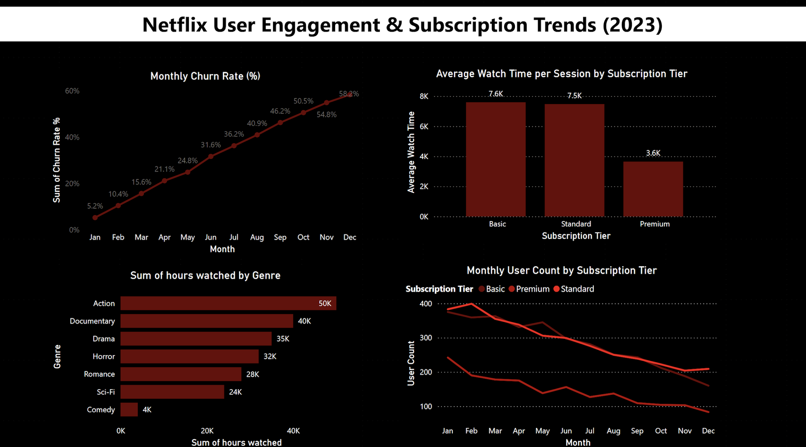

# 📈 Netflix User Engagement & Subscription Trend Analysis (2023)

## 📚 Project Background
Netflix, a global leader in streaming services, serves millions of subscribers worldwide.  
This project analyzes 2023 subscription patterns, user engagement behaviors, and content preferences to deliver actionable insights aimed at reducing churn, boosting engagement, and guiding content strategy decisions.
Dataset link - https://www.kaggle.com/datasets/abood1120/netflix-customer-churn-dataset?utm_source=chatgpt.com
---

## 🚀 Business Goals
- Track subscription growth trends across different tiers.
- Analyze churn rates by subscription tier and time periods.
- Identify popular content genres based on user engagement.
- Evaluate average watch time and session frequency.
- Provide data-driven recommendations for marketing and content strategy.

---

## 📚 Data Description & Structure
The dataset simulates Netflix’s user subscription and engagement activity for 2023:
- **Subscriptions:** subscription_id, user_id, subscription_tier, start_date, end_date, status
- **User Engagement:** user_id, month_year, hours_watched, session_count
- **Content Genres:** genre, region, age_group, total_watch_hours
- **Churn Data:** Churn flags for monthly cancellations
- **Revenue:** month_year, subscription_tier, revenue_amount

---

## 🧹 Data Cleaning & Preparation

The dataset was cleaned, prepared, and analyzed using **Excel** and **Python**:

### 🔹 Excel (Data Cleaning and Feature Creation)
- **Date Formatting:**  
  - Combined Year and Month into a proper `Date` column (`YYYY-MM` format).
  - Extracted `Year` and `Month` as separate columns for time-series analysis.
- **Added New Calculations:**  
  - Created `Average Watch Time per Session` by dividing `HoursWatched` by `SessionsCount` using Excel formulas.
- **Standardization:**  
  - Ensured consistent formatting for categorical variables (`SubscriptionTier`, `Churned`, `ContentGenreFavorite`).
  - Retained `Unknown` values to realistically reflect missing information.
- **Initial Clean-Up:**  
  - Fixed data types (e.g., text fields, numeric fields).
  - Checked for and removed duplicate rows based on `UserID` and `Date`.

### 🔹 Excel (Pivot Table Analysis)
- **Popular Content Genres:**  
  - Built a pivot table to summarize total `HoursWatched` by content genre.
- **User Engagement by Subscription Tier:**  
  - Pivoted average watch time and session counts across Basic, Standard, and Premium tiers.
- **Monthly Churn Rate:**  
  - Calculated the monthly churn percentage by comparing churned users to total active users each month.
- **Subscription Growth Trends by Tier and Time:**  
  - Tracked monthly user count trends segmented by subscription tier using pivot tables.

- **Export for Visualization:**  
  - Pivot table outputs and cleaned dataset were exported into Power BI for dashboard creation.

### 🔹 Python (Validation and Export)
- **Dataset Validation:**  
  - Imported the cleaned Excel dataset using `pandas`.
  - Verified column data types and checked for missing values.
  - Reformatted date columns for consistency (`pd.to_datetime()`).
- **Export:**  
  - Exported the validated dataset as a `.csv` file for Power BI dashboard development.

---

## 🧩 Executive Summary
Analysis of Netflix’s user engagement and subscription trends in 2023 reveals an alarming rise in churn rates, particularly in Q4, with December reaching 58.2%. Action and Documentary genres emerged as the most engaging, while Basic and Standard tiers outperformed Premium in user retention and watch time.

User activity declines toward the year-end, suggesting seasonal disengagement. Strategic efforts focused on high-performing genres, re-engaging Premium tier users, and enhancing loyalty programs can drive sustainable retention and growth.

---

## 📊 Insights Deep Dive

### 🚀 Subscription and Churn Trends
- Churn increased steadily from **5.2%** (January) to **58.2%** (December).
- Subscriber losses were most significant during Q4, indicating a seasonal pattern.

📈 **Dashboard Snapshot:**

---

### ⏳ User Engagement Trends
- **Average Watch Time** per session:
  - Basic: **7.6K hours**
  - Standard: **7.5K hours**
  - Premium: **3.6K hours** (significantly lower)

---

### 🎬 Content Genre Popularity
- **Top Genres by Total Hours Watched:**
  - Action: **50K hours**
  - Documentary: **40K hours**
  - Drama: **35K hours**

---

### 👥 User Count by Subscription Tier
- Basic and Standard tiers maintained higher retention across the year.
- Premium subscriptions saw the steepest declines, especially mid-year.

---

## 📝 Recommendations
Retention Strategy for Q4
Launch proactive churn prevention campaigns starting in Q3.
Offer £2/month discounts for at-risk users in Q4 to keep them subscribed during seasonal drop-offs.
Provide holiday bundles (e.g., 3 months for the price of 2) to encourage commitment.
Content Investment
Prioritise Action and Documentary genres, which drove the highest engagement.
Bundle genres (e.g., Action + Drama boxsets) to increase perceived value without raising costs.
Premium Tier Revamp
Add exclusive perks (early access, behind-the-scenes content).
Allow flexible downgrades to Standard instead of full cancellations to retain partial revenue.
Test cashback vouchers (£5 credit) for Premium renewals.
User Engagement Initiatives
Send personalised watchlist emails to inactive users highlighting trending Action/Documentary titles.
Introduce loyalty points redeemable for free months, reducing drop-off in low-activity segments.

---

## ⚙️ Assumptions and Caveats
- The dataset is a simulation and may not fully reflect real Netflix data.
- Churn is defined based on subscription end with no renewal.
- Regional segmentation was not available; insights are global.
- Seasonal trends observed may vary due to external factors like new releases or promotions.

---

## 📂 Files and Resources
- 📄 `cleaned_netflix_data.xlsx` — Cleaned Dataset
- 📊 `netflix_dashboard.pbix` — Power BI Dashboard File
- 📷 `dashboard_screenshot.png` — Dashboard Snapshot

---

> For more of my projects and data journey, visit my [Portfolio](https://www.datascienceportfol.io/angdwina1)
